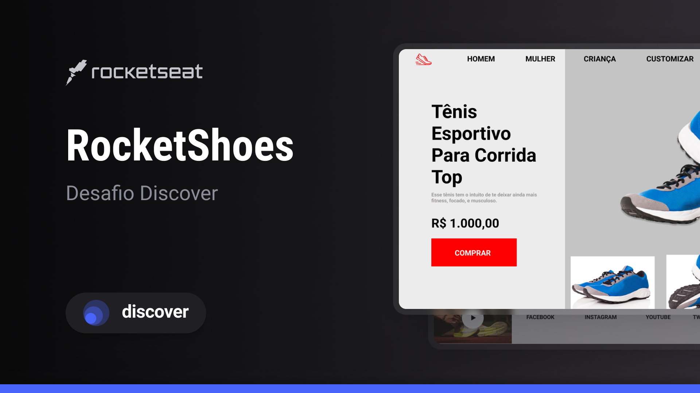

  

<!--  -->

<h2 align="center">Tecnologias 🚀</h2>
   

Esse projeto foi desenvolvido com as seguintes tecnologias:

- **HTML** **e** **CSS**

  
  ---
  <h3 align="center">Projeto💻 </h3>
  
Acesse o projeto em <a href="https://micaela-marques.github.io/rocketshoes/"> site🌐
  

---

<h2 align="center">Layout 🎨</h2>

 

   
Você pode visualizar o layout do projeto atraves desse link  <a href="https://figma.com"> site
   
 

---

